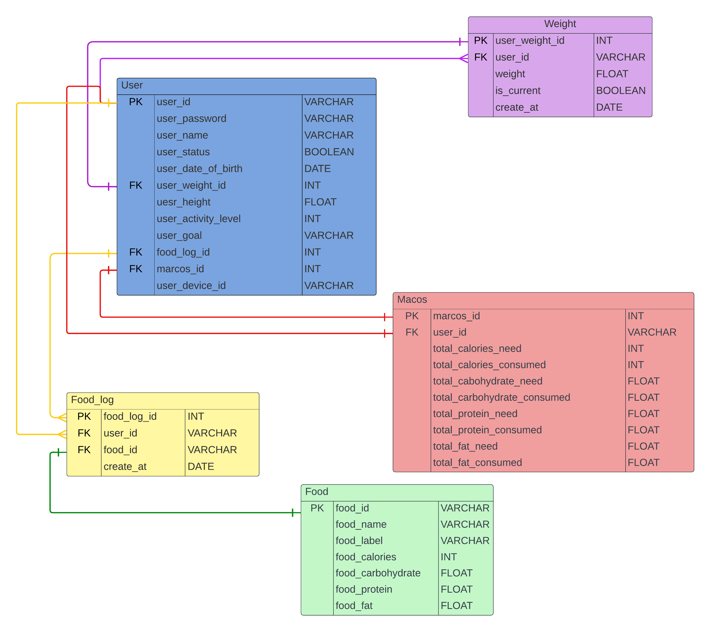

# GOOD FOOD 4 LIFE
Welcome to the calorie-tracking mobile application designed to assist you in maintaining a healthier lifestyle.

>This project was developed using Expo and React. 

Taking inspiration from the user-friendly interface of the myFitnessPal application, which I found remarkable during my personal usage, this application aims to provide a similar level of functionality and ease of use. It is important to note that this project, while influenced by myFitnessPal, is intended solely for educational purposes as part of the ICCS444 e-commerce course and is not intended for commercial use.

I extend my sincere gratitude to ***Mr. Poramin Bheganan*** for his invaluable support and guidance throughout the development process.

> Objectives:
- Facilitate users in achieving their fitness goals, whether they aim to gain or lose weight.
- Provide users with a comprehensive overview of their daily calorie intake, aiding them in their journey towards their desired fitness outcomes.
- Incorporate a barcode scanning feature to swiftly obtain nutritional information for various products.

> However, in line with the nature of the e-commerce course, this application is designed as a freemium model, where additional features are accessible through paid subscriptions.
- Premium subscribers will have access to detailed information regarding carbohydrate, protein, and fat content.
- Enjoy an ad-free experience.


This application is crafted with the utmost dedication to assist users in their pursuit of a healthier lifestyle. Thank you for choosing Good Food 4 Life as your wellness companion.


### Running the Application

To start the application, run the following commands:

```bash
npm start
```
```bash
cd ../api stepzen start
```



"main": "expo-router/entry",